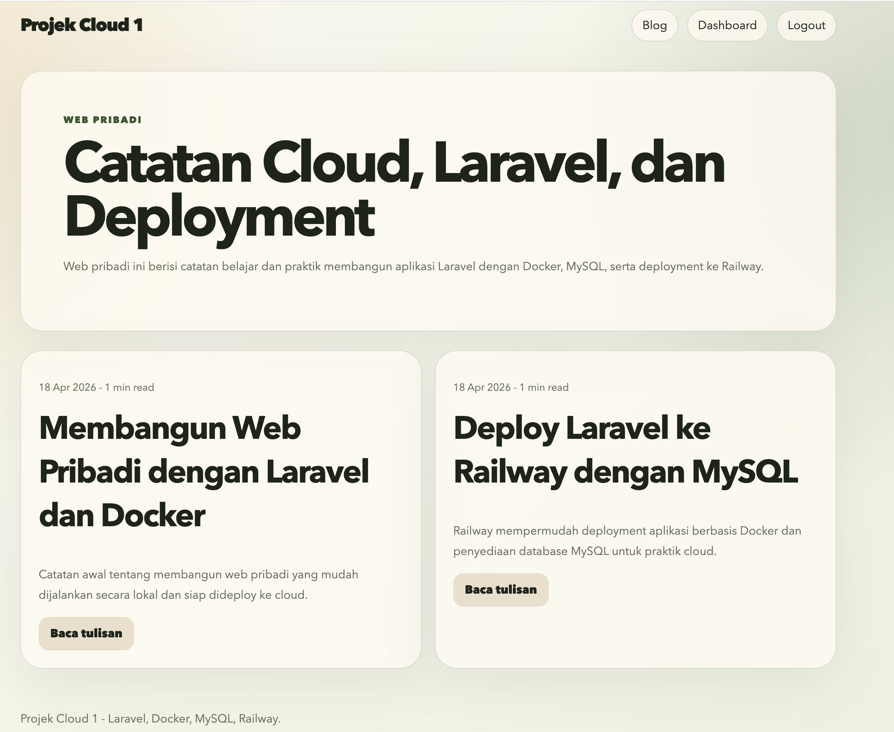
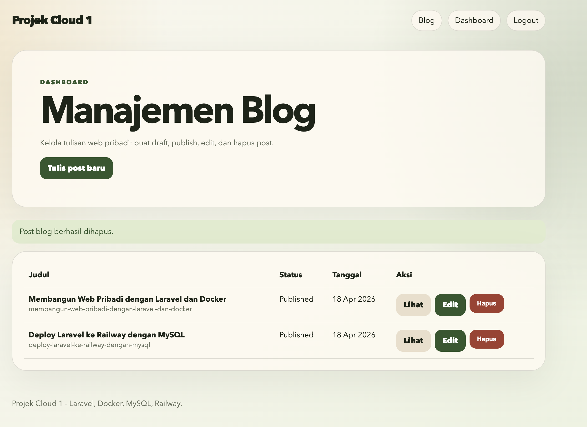
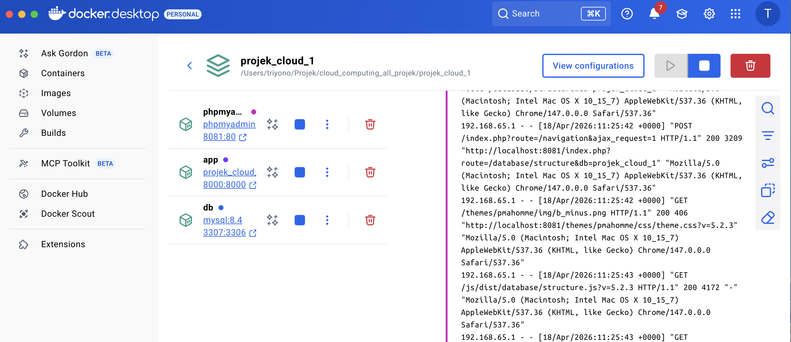
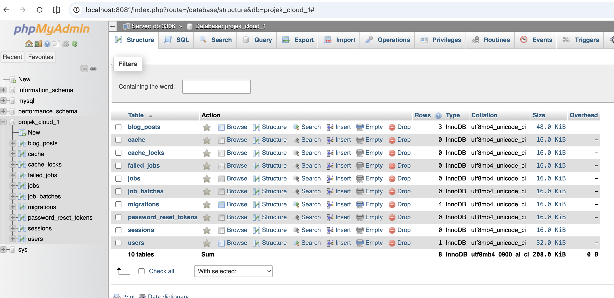
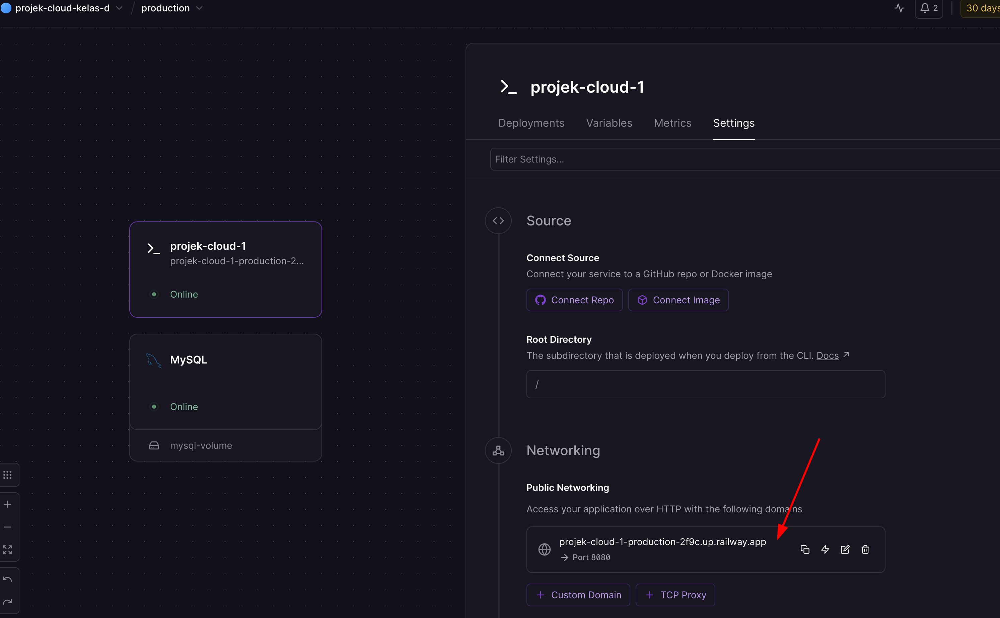

# Projek Cloud 1

Project praktik Laravel + Docker + MySQL + phpMyAdmin + Railway CLI.

Project ini dibuat sebagai studi kasus web pribadi dengan fitur blog, login admin, dashboard manajemen blog, Docker lokal, dan deployment ke Railway.

## Mulai dari Sini

Untuk pemula yang ingin langsung praktik, gunakan tutorial utama:

### [Buka tutorial_v2.md](tutorial_v2.md)

[tutorial_v2.md](tutorial_v2.md) berisi langkah lengkap dari awal:

1. Clone project dari GitHub.
2. Setup `.env`.
3. Generate `APP_KEY`.
4. Jalankan Laravel, MySQL, dan phpMyAdmin dengan Docker.
5. Login ke aplikasi dan phpMyAdmin.
6. Validasi lokal.
7. Setup Railway CLI.
8. Deploy ke Railway.
9. Set domain dan `APP_URL`.
10. Troubleshooting error umum.

## Quick Start Lokal

Jika ingin langsung menjalankan project di komputer lokal:

```bash
git clone https://github.com/triyono777/projek_cloud_1.git
cd projek_cloud_1
cp .env.example .env
docker compose build app
docker compose run --rm --no-deps app php artisan key:generate
docker compose up --build
```

Setelah service aktif, buka:

```text
Aplikasi: http://localhost:8000
Login aplikasi: http://localhost:8000/login
Health check: http://localhost:8000/health
phpMyAdmin: http://localhost:8081
```

Login aplikasi:

```text
Email: admin@example.com
Password: password
```

Login phpMyAdmin:

```text
Server: db
Username: projek_cloud_1
Password: secret123
```

Keterangan sumber setting phpMyAdmin dari `compose.yaml`:

- Server `db` berasal dari nama service database dan `PMA_HOST: db` pada service `phpmyadmin`.
- Username `projek_cloud_1` berasal dari `MYSQL_USER: ${DB_USERNAME:-projek_cloud_1}`.
- Password `secret123` berasal dari `MYSQL_PASSWORD: ${DB_PASSWORD:-secret123}`.
- URL `http://localhost:8081` berasal dari port mapping `${PHPMYADMIN_PORT:-8081}:80`.

## Preview

Screenshot lengkap tersedia di folder [image_tutorial](image_tutorial) dan dijelaskan langkah demi langkah di [tutorial_v2.md](tutorial_v2.md).

### Halaman Utama



### Dashboard Admin



### Docker Lokal



### phpMyAdmin



### Railway Domain



## Tutorial

| File | Fokus | Kapan Dipakai |
| --- | --- | --- |
| [tutorial_v2.md](tutorial_v2.md) | Tutorial utama dari clone, Docker lokal, validasi lokal, sampai deploy Railway | Wajib dibaca pertama untuk pemula |
| [tutorial_docker.md](tutorial_docker.md) | Konsep Docker, file Docker yang dibuat, `Dockerfile`, `compose.yaml`, dan studi kasus Laravel | Dipakai saat ingin memahami Docker lebih dalam |
| [tutorial.md](tutorial.md) | Modul lengkap Laravel, Docker, MySQL, Railway CLI, dan troubleshooting | Dipakai sebagai referensi tambahan |

## Fitur Aplikasi

- Halaman blog publik di `/`.
- Detail post di `/blog/{slug}`.
- Login dashboard di `/login`.
- Dashboard manajemen blog di `/dashboard/posts`.
- CRUD post blog: tambah, edit, publish/draft, hapus.
- Health check aplikasi dan database di `/health`.
- Health check ringan Railway di `/up`.

## Stack

- Laravel 13
- PHP 8.4
- MySQL 8.4
- phpMyAdmin 5.2 untuk lokal
- Docker Compose
- Railway CLI
- Railway service berbasis Dockerfile

## File Penting

- `Dockerfile`: image PHP untuk aplikasi Laravel.
- `compose.yaml`: stack lokal Laravel + MySQL + phpMyAdmin.
- `docker/start.sh`: startup script untuk menunggu database, menjalankan migrasi, seeding, dan server Laravel.
- `railway.json`: konfigurasi build dan deploy Railway; Railway memakai `/up` untuk health check platform.
- `routes/web.php`: route aplikasi, termasuk `/`, `/login`, `/dashboard/posts`, `/up`, dan `/health`.
- `tutorial_v2.md`: tutorial utama dari clone sampai deploy.
- `tutorial_docker.md`: tutorial khusus Docker.
- `tutorial.md`: tutorial lengkap tambahan.

## Railway Ringkas

Login Railway CLI:

```bash
railway login
```

Link atau buat project:

```bash
railway link
```

Deploy:

```bash
railway up --service projek-cloud-1
```

Generate domain Railway:

```bash
railway domain --service projek-cloud-1
```

Set `APP_URL` sesuai domain Railway yang aktif:

```bash
railway variable set APP_URL="https://domain-anda.up.railway.app" --service projek-cloud-1
```

Panduan lengkap Railway ada di [tutorial_v2.md](tutorial_v2.md).

## Troubleshooting Singkat

Port aplikasi `8000` dipakai:

```bash
APP_PORT=8080 docker compose up --build
```

Port MySQL `3307` dipakai:

```bash
DB_FORWARD_PORT=3308 docker compose up --build
```

Port phpMyAdmin `8081` dipakai:

```bash
PHPMYADMIN_PORT=8082 docker compose up --build
```

Railway halaman `/`, `/login`, atau `/health` menampilkan `500 Server Error`:

```bash
railway variable list --service projek-cloud-1
```

Pastikan variable berikut tersedia:

```text
APP_NAME
APP_ENV
APP_DEBUG
APP_KEY
APP_URL
MYSQLHOST
MYSQLPORT
MYSQLDATABASE
MYSQLUSER
MYSQLPASSWORD
```

Setelah variable diperbaiki, deploy ulang:

```bash
railway up --service projek-cloud-1
```

## Referensi

- [Railway CLI](https://docs.railway.com/guides/cli)
- [Railway Deployments](https://docs.railway.com/guides/deployments)
- [Railway Databases](https://docs.railway.com/guides/databases)
