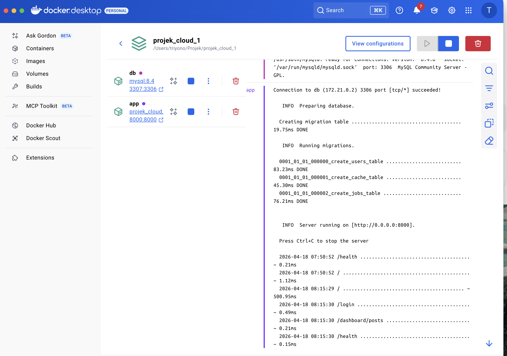
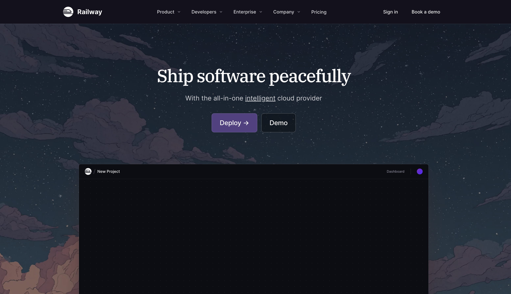
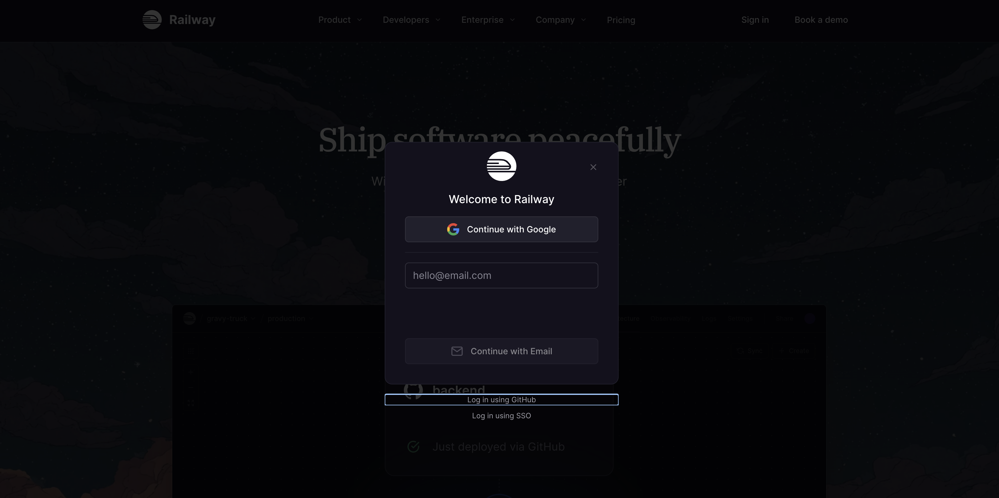
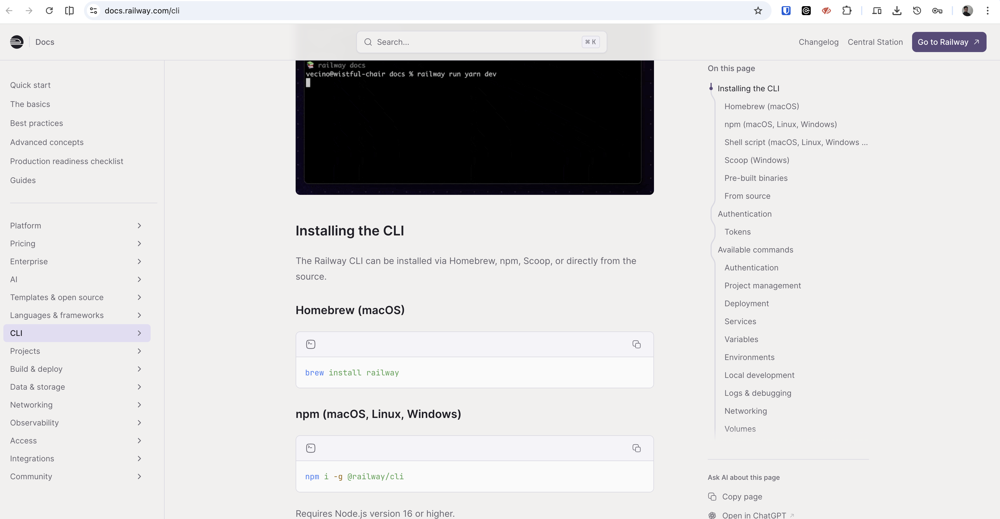
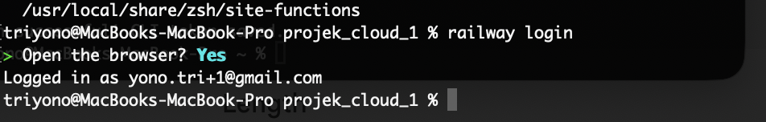
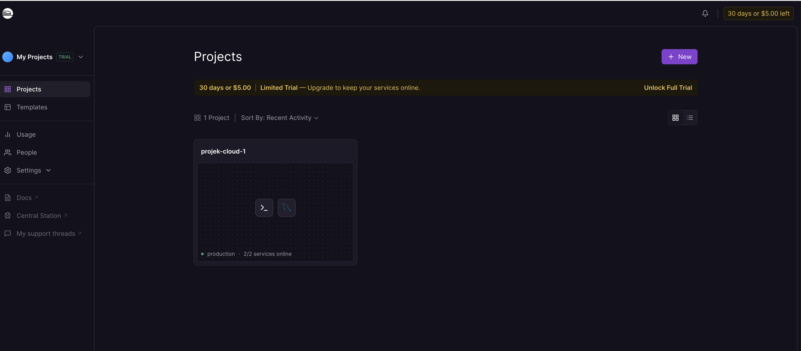
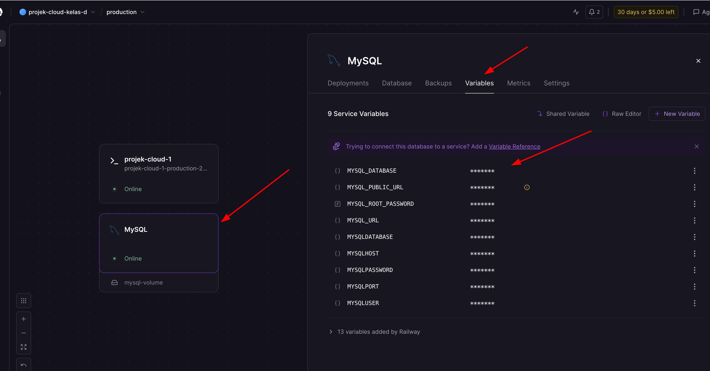

# Tutorial V2: Clone Laravel, Jalankan Docker Lokal, lalu Deploy Railway

Panduan ini dibuat untuk pemula yang ingin menjalankan project Laravel web pribadi dari awal. Urutan utamanya adalah `git clone`, jalankan aplikasi secara lokal dengan Docker dan MySQL, pastikan aplikasi lokal berjalan benar, baru lanjut deploy ke Railway menggunakan Railway CLI.

Repository project:

```text
https://github.com/triyono777/projek_cloud_1
```

URL production:

```text
https://projek-cloud-1-production.up.railway.app
```

## 1. Tujuan Praktikum

Setelah mengikuti tutorial ini, mahasiswa diharapkan bisa:

- Mengambil project dari GitHub dengan `git clone`.
- Memahami struktur project Laravel.
- Menjalankan Laravel dan MySQL memakai Docker Compose.
- Login ke dashboard blog.
- Mengelola artikel blog.
- Menggunakan Railway CLI.
- Men-deploy aplikasi Laravel Docker ke Railway.
- Mengecek hasil deploy melalui domain publik dan endpoint `/health`.

## 2. Gambaran Besar

Alur kerja project ini:

```text
GitHub -> git clone -> Docker lokal -> Laravel + MySQL -> Railway CLI -> Railway production
```

Urutan pengerjaan wajib:

1. Clone project dari GitHub.
2. Buat file `.env`.
3. Generate `APP_KEY` Laravel.
4. Jalankan Docker lokal.
5. Buka halaman `http://localhost:8000`.
6. Cek `http://localhost:8000/health`.
7. Login ke dashboard lokal.
8. Jalankan test.
9. Commit dan push perubahan.
10. Baru lanjut ke Railway.

Jangan lanjut ke Railway jika aplikasi lokal belum berjalan. Deploy cloud akan lebih sulit diperbaiki jika error lokal belum jelas.

Penjelasan singkat:

- GitHub menyimpan source code.
- `git clone` mengambil source code ke komputer lokal.
- Docker menjalankan aplikasi tanpa perlu setup server manual.
- MySQL menyimpan data user dan artikel blog.
- Railway menjalankan aplikasi agar bisa diakses dari internet.

## 3. Software yang Dibutuhkan

Pastikan software berikut sudah terinstall:

- Git
- Docker Desktop
- PHP
- Composer
- Node.js dan npm
- Railway CLI

Cek Git:

```bash
git --version
```

Cek Docker:

```bash
docker --version
docker compose version
```

Cek PHP dan Composer:

```bash
php --version
composer --version
```

Cek npm:

```bash
npm --version
```

Cek Railway CLI:

```bash
railway --version
```

Jika ada perintah yang belum dikenali, install software tersebut terlebih dahulu.

## 4. Clone Project dari GitHub

Masuk ke folder tempat menyimpan project:

```bash
cd /Users/triyono/Projek
```

Clone repository:

```bash
git clone https://github.com/triyono777/projek_cloud_1.git
```

Masuk ke folder project:

```bash
cd projek_cloud_1
```

Cek isi folder:

```bash
ls
```

Jika folder project sudah ada sebelumnya, tidak perlu clone ulang. Masuk ke folder project lalu ambil update terbaru:

```bash
cd /Users/triyono/Projek/projek_cloud_1
git pull
```

Cek status Git:

```bash
git status
```

Jika output menampilkan `working tree clean`, berarti tidak ada perubahan lokal yang belum di-commit.

## 5. Struktur Project

File dan folder penting:

- `Dockerfile`: instruksi membuat image Docker Laravel.
- `compose.yaml`: menjalankan container Laravel, MySQL, dan phpMyAdmin secara lokal.
- `docker/start.sh`: script startup aplikasi.
- `railway.json`: konfigurasi build dan deploy Railway.
- `.env.example`: contoh file environment Laravel.
- `routes/web.php`: route halaman web.
- `resources/views`: tampilan Blade.
- `database/migrations`: struktur tabel database.
- `database/seeders`: data awal aplikasi.
- `image_tutorial`: gambar pendukung tutorial.

## 6. Membuat File .env Lokal

Laravel membutuhkan file `.env`.

Jika belum ada, buat dari `.env.example`:

```bash
cp .env.example .env
```

Setelah `.env` dibuat, generate application key Laravel:

```bash
docker compose build app
docker compose run --rm --no-deps app php artisan key:generate
```

Penjelasan:

- `docker compose build app` membuat image aplikasi agar dependency Laravel tersedia di container.
- `docker compose run --rm --no-deps app php artisan key:generate` mengisi `APP_KEY` di file `.env`.
- `--no-deps` membuat perintah ini tidak perlu menyalakan MySQL karena generate key tidak membutuhkan database.

Pastikan `APP_KEY` sudah terisi:

```bash
grep APP_KEY .env
```

Contoh hasil yang benar:

```text
APP_KEY=base64:xxxxxxxxxxxxxxxxxxxxxxxxxxxxxxxxxxxxxxxxxxx
```

Pastikan konfigurasi database lokal di `.env` seperti ini:

```env
DB_CONNECTION=mysql
DB_HOST=db
DB_PORT=3306
DB_DATABASE=projek_cloud_1
DB_USERNAME=projek_cloud_1
DB_PASSWORD=secret123
PHPMYADMIN_PORT=8081
```

Penjelasan:

- `DB_HOST=db` dipakai karena container Laravel mengakses container MySQL dengan nama service `db`.
- `DB_PORT=3306` adalah port MySQL di dalam container.
- Dari komputer host, MySQL diteruskan ke port `3307`.
- `PHPMYADMIN_PORT=8081` membuka phpMyAdmin lokal di browser.
- `APP_KEY` wajib terisi agar fitur session, cookie, login, dan enkripsi Laravel berjalan benar.

## 7. Menjalankan Project dengan Docker

Jalankan Docker Desktop terlebih dahulu.

Lalu dari folder project jalankan:

```bash
docker compose up --build
```

Perintah ini akan:

- Membuat image aplikasi Laravel dari `Dockerfile`.
- Menjalankan container Laravel.
- Menjalankan container MySQL.
- Menjalankan container phpMyAdmin untuk kebutuhan database lokal.
- Membaca konfigurasi dari `.env`.
- Menjalankan migration.
- Menjalankan seeder.
- Menjalankan Laravel di port `8000`.

Setelah service aktif, alamat lokal yang bisa dibuka:

```text
Aplikasi: http://localhost:8000
Health check: http://localhost:8000/health
phpMyAdmin: http://localhost:8081
```

Jika sebelumnya sudah menjalankan `docker compose build app`, perintah `docker compose up --build` tetap aman dijalankan. Docker akan memakai cache build jika tidak ada perubahan besar.

Tampilan Docker Desktop saat container berjalan:



Jika ingin menjalankan di background:

```bash
docker compose up -d --build
```

Cek container:

```bash
docker compose ps
```

Hentikan container:

```bash
docker compose down
```

## 8. Membuka Aplikasi Lokal

Buka browser:

```text
http://localhost:8000
```

Tampilan halaman utama:


Cek health endpoint:

```text
http://localhost:8000/health
```

Jika berhasil, response akan berisi status aplikasi dan database:

```json
{
  "status": "ok",
  "database": {
    "connection": "mysql",
    "status": "connected"
  }
}
```

## 9. Login Dashboard Blog

Akun admin default:

```text
Email: admin@example.com
Password: password
```

Buka halaman login:

```text
http://localhost:8000/login
```

Setelah login, buka dashboard:

```text
http://localhost:8000/dashboard/posts
```

Tampilan dashboard admin:


Fitur dashboard:

- Melihat daftar artikel.
- Menambah artikel.
- Mengedit artikel.
- Mengubah artikel menjadi publish atau draft.
- Menghapus artikel.

## 10. Perintah Laravel di Dalam Docker

Generate ulang `APP_KEY` jika `.env` baru dibuat atau `APP_KEY` masih kosong:

```bash
docker compose run --rm --no-deps app php artisan key:generate
```

Jalankan migration:

```bash
docker compose exec app php artisan migrate
```

Jalankan seeder:

```bash
docker compose exec app php artisan db:seed
```

Lihat daftar route:

```bash
docker compose exec app php artisan route:list
```

Masuk ke shell container aplikasi:

```bash
docker compose exec app sh
```

Jalankan test:

```bash
docker compose exec app php artisan test
```

Jika menjalankan test dari host dan dependency sudah tersedia:

```bash
php artisan test
```

## 11. Checklist Wajib Sebelum Railway

Sebelum membuka Railway atau menjalankan `railway up`, pastikan semua checklist lokal ini selesai.

Checklist lokal:

- Docker Desktop sudah berjalan.
- File `.env` sudah dibuat dari `.env.example`.
- `APP_KEY` di `.env` sudah terisi.
- `docker compose up --build` berhasil.
- Container `app` dan `db` aktif.
- Halaman `http://localhost:8000` bisa dibuka.
- Endpoint `http://localhost:8000/health` menampilkan database `connected`.
- Halaman `http://localhost:8000/login` bisa dibuka.
- Login dengan `admin@example.com` dan password `password` berhasil.
- Dashboard `http://localhost:8000/dashboard/posts` bisa dibuka setelah login.
- Test Laravel berhasil.

Perintah cek cepat:

```bash
docker compose ps
grep APP_KEY .env
curl -sS http://localhost:8000/health
docker compose exec app php artisan test
```

Jika salah satu langkah gagal, perbaiki lokal dulu. Railway dipakai setelah aplikasi terbukti berjalan di Docker lokal.

## 12. Commit dan Push Perubahan

Setiap selesai mengubah project, biasakan membuat commit.

Cek file yang berubah:

```bash
git status
```

Tambahkan semua perubahan:

```bash
git add .
```

Buat commit:

```bash
git commit -m "Tulis pesan perubahan"
```

Push ke GitHub:

```bash
git push
```

Contoh:

```bash
git add .
git commit -m "Update tutorial deployment"
git push
```

## 13. Daftar dan Login Railway

Buka Railway:

```text
https://railway.com
```

Langkah umum:

1. Klik sign up atau login.
2. Gunakan akun GitHub.
3. Izinkan Railway mengakses repository jika diminta.
4. Masuk ke dashboard Railway.

Tampilan halaman utama Railway:



Tampilan halaman login Railway:



## 14. Install dan Login Railway CLI

Jika Railway CLI belum ada, install:

```bash
npm install -g @railway/cli
```

Contoh panduan install Railway CLI:



Cek versi:

```bash
railway --version
```

Login:

```bash
railway login
```

Contoh login Railway CLI di terminal:



Cek akun aktif:

```bash
railway whoami
```

Jika berhasil, Railway CLI siap digunakan.

## 15. Membuat atau Menghubungkan Project Railway

Jika belum punya project Railway:

```bash
railway init --name projek-cloud-1
```

Jika project Railway sudah ada:

```bash
railway link
```

Cek status:

```bash
railway status
```

Pastikan project, environment, dan service sudah benar.

Contoh dashboard project Railway:



## 16. Membuat Service MySQL Railway

Tambahkan database MySQL:

```bash
railway add --database mysql
```

Cek variable MySQL:

```bash
railway variable list --service MySQL
```

Variable penting:

```text
MYSQLHOST
MYSQLPORT
MYSQLDATABASE
MYSQLUSER
MYSQLPASSWORD
```

Jangan menaruh nilai password production ke file project atau GitHub.

## 17. Membuat Service Aplikasi Railway

Jika service aplikasi belum ada:

```bash
railway add --service projek-cloud-1
```

Project ini memakai `railway.json`:

```json
{
  "build": {
    "builder": "DOCKERFILE",
    "dockerfilePath": "Dockerfile"
  },
  "deploy": {
    "startCommand": "start-app",
    "healthcheckPath": "/up"
  }
}
```

Artinya:

- Railway build aplikasi dari `Dockerfile`.
- Railway menjalankan command `start-app`.
- Railway mengecek container aplikasi lewat `/up`.
- Endpoint `/health` tetap dipakai manual untuk mengecek aplikasi plus database.

## 18. Set Environment Variable Railway

Buat `APP_KEY`:

```bash
docker compose run --rm --no-deps app php artisan key:generate --show
```

Perintah ini hanya menampilkan key baru untuk production. Salin hasilnya, lalu pakai untuk variable `APP_KEY` di Railway.

Set variable Laravel:

```bash
railway variable set APP_NAME="Projek Cloud 1" APP_ENV=production APP_DEBUG=false APP_KEY=base64:ISI_APP_KEY_ANDA --service projek-cloud-1
```

Jika ingin set URL production manual:

```bash
railway variable set APP_URL=https://projek-cloud-1-production.up.railway.app --service projek-cloud-1
```

Jika variable MySQL belum masuk ke service aplikasi, salin dari service MySQL:

```bash
railway variable list --service MySQL --json
```

Contoh tampilan variable database MySQL di Railway:



Set ke service aplikasi:

```bash
railway variable set MYSQLHOST="mysql.railway.internal" --service projek-cloud-1
railway variable set MYSQLPORT="3306" --service projek-cloud-1
railway variable set MYSQLDATABASE="railway" --service projek-cloud-1
railway variable set MYSQLUSER="root" --service projek-cloud-1
railway variable set MYSQLPASSWORD="password-dari-railway" --service projek-cloud-1
```

Catatan:

- Ganti `password-dari-railway` dengan password asli dari variable `MYSQLPASSWORD` di service MySQL Railway.
- Jika nilai `MYSQLHOST`, `MYSQLPORT`, `MYSQLDATABASE`, atau `MYSQLUSER` di Railway berbeda, gunakan nilai asli dari output `railway variable list --service MySQL --json`.
- Jangan commit secret ke GitHub.
- Simpan secret hanya di Railway variable.

## 19. Deploy ke Railway

Deploy dari folder project:

```bash
railway up --service projek-cloud-1
```

Deploy tanpa mengikuti log:

```bash
railway up --service projek-cloud-1 --detach
```

Deploy dengan pesan:

```bash
railway up --service projek-cloud-1 --detach --message "Deploy Laravel blog"
```

Cek deployment:

```bash
railway deployment list --service projek-cloud-1
```

Cek deployment terbaru dalam JSON:

```bash
railway deployment list --service projek-cloud-1 --json --limit 1
```

Status umum:

- `BUILDING`: Railway sedang build image.
- `DEPLOYING`: Railway sedang menjalankan container.
- `SUCCESS`: deploy berhasil.
- `FAILED`: deploy gagal.

## 20. Melihat Log Railway

Jika deploy gagal atau aplikasi error, lihat log:

```bash
railway logs --service projek-cloud-1
```

Log biasanya menunjukkan error seperti:

- `APP_KEY` belum diset.
- Database belum terhubung.
- Migration gagal.
- Health check gagal.
- Port aplikasi salah.

Jika log deploy menampilkan banyak request ke `/health` lalu muncul `Deploy failed` atau `service unavailable`, berarti project masih memakai health check lama. Ambil update terbaru lalu deploy ulang:

```bash
git pull
railway up --service projek-cloud-1
```

## 21. Membuat Domain Railway

Buat domain:

```bash
railway domain --service projek-cloud-1
```

Buka domain production:

```text
https://projek-cloud-1-production.up.railway.app
```

Cek health production:

```text
https://projek-cloud-1-production.up.railway.app/up
https://projek-cloud-1-production.up.railway.app/health
```

## 22. Validasi Setelah Deploy

Cek aplikasi hidup dengan `curl`:

```bash
curl -I https://projek-cloud-1-production.up.railway.app/up
```

Cek health database dengan `curl`:

```bash
curl -sS https://projek-cloud-1-production.up.railway.app/health
```

Cek halaman utama:

```bash
curl -sS https://projek-cloud-1-production.up.railway.app
```

Cek login:

```bash
curl -I https://projek-cloud-1-production.up.railway.app/login
```

Cek dashboard tanpa login:

```bash
curl -I https://projek-cloud-1-production.up.railway.app/dashboard/posts
```

Hasil yang benar:

- `/up` mengembalikan HTTP `200`.
- `/health` menampilkan status `ok`.
- Database menampilkan status `connected`.
- `/login` menampilkan HTTP `200`.
- `/dashboard/posts` redirect ke `/login` jika belum login.

## 23. Apa yang Dilakukan docker/start.sh

Saat container berjalan, Railway dan Docker menjalankan:

```bash
start-app
```

Command tersebut berasal dari:

```text
docker/start.sh
```

Script ini melakukan:

- Membaca variable Railway.
- Mengatur koneksi database Laravel.
- Menunggu database siap.
- Menjalankan migration.
- Menjalankan seeder.
- Menjalankan Laravel server.

Bagian penting:

```bash
php artisan migrate --force
php artisan db:seed --force
```

`--force` diperlukan karena command berjalan di environment production.

## 24. Troubleshooting Docker

Jika port `8000` sudah dipakai:

```bash
APP_PORT=8080 docker compose up --build
```

Buka:

```text
http://localhost:8080
```

Jika port MySQL `3307` sudah dipakai:

```bash
DB_FORWARD_PORT=3308 docker compose up --build
```

Jika port phpMyAdmin `8081` sudah dipakai:

```bash
PHPMYADMIN_PORT=8082 docker compose up --build
```

Jika container error:

```bash
docker compose logs app
docker compose logs db
```

Jika ingin reset database lokal:

```bash
docker compose down -v
docker compose up --build
```

Hati-hati, `docker compose down -v` akan menghapus data MySQL lokal.

## 25. Troubleshooting Railway

Jika CLI belum login:

```bash
railway login
railway whoami
```

Jika folder belum terhubung ke project:

```bash
railway link
railway status
```

Jika deploy gagal:

```bash
railway deployment list --service projek-cloud-1
railway logs --service projek-cloud-1
```

Jika database gagal:

```bash
railway variable list --service projek-cloud-1
railway variable list --service MySQL
```

Pastikan variable berikut tersedia di service aplikasi:

```text
APP_KEY
APP_ENV
APP_DEBUG
MYSQLHOST
MYSQLPORT
MYSQLDATABASE
MYSQLUSER
MYSQLPASSWORD
```

Jika redirect berubah menjadi `http`, cek konfigurasi trusted proxy di:

```text
bootstrap/app.php
```

## 26. Ringkasan Perintah Utama

Clone project:

```bash
cd /Users/triyono/Projek
git clone https://github.com/triyono777/projek_cloud_1.git
cd projek_cloud_1
```

Jalankan lokal:

```bash
cp .env.example .env
docker compose build app
docker compose run --rm --no-deps app php artisan key:generate
docker compose up --build
```

Validasi lokal sebelum Railway:

```bash
docker compose ps
grep APP_KEY .env
curl -sS http://localhost:8000/health
docker compose exec app php artisan test
```

Login dashboard:

```text
http://localhost:8000/login
```

Railway CLI:

```bash
railway login
railway link
railway status
railway up --service projek-cloud-1 --detach
railway logs --service projek-cloud-1
```

Commit perubahan:

```bash
git status
git add .
git commit -m "Pesan perubahan"
git push
```

## 27. Latihan

Latihan dasar:

1. Clone project dari GitHub.
2. Jalankan project dengan Docker.
3. Buka halaman utama.
4. Login ke dashboard.
5. Tambah artikel baru.
6. Jalankan test.
7. Commit perubahan.
8. Push ke GitHub.
9. Deploy ulang ke Railway.
10. Cek `/health` di production.

Latihan lanjutan:

1. Tambahkan kategori blog.
2. Tambahkan halaman profil.
3. Tambahkan upload gambar artikel.
4. Tambahkan pencarian artikel.
5. Tambahkan pagination.

## 28. Kesimpulan

Tutorial ini menunjukkan alur lengkap dari source code sampai production:

```text
git clone -> Docker -> Laravel -> MySQL -> GitHub -> Railway CLI -> production
```

Jika semua langkah berhasil, aplikasi Laravel sudah bisa berjalan secara lokal dan sudah bisa diakses publik melalui Railway.
